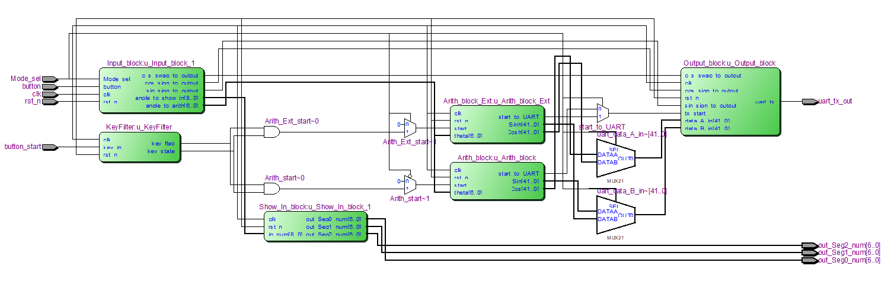

# CORDIC算法-旋转模式
本项目为数字逻辑课的课后设计 
## 系统框图
顶层模块包含输入模块、输入显示模块、运算模块、输出模块 

## 数据类型定义
计算结果精度要求达到小数点后10位，用定点数表示，小数位数对应二进制数34位   
输入范围为0-360度，需要9位表示，考虑到不同象限内的角度可以转换到第一象限，角度的表示可以限制在0-90，需要7位来表示   
在运算过程中使用有符号运算，需要一位符号位   
最终数据结构为 `1(signed) + 7(int) + 34(deci) = 42 bit` 

## 模块说明
### 顶层模块CORDIC_top
内含各模块的例化，以及模式选择的控制电路。
### 输入模块Input_block
由按键控制，对计数器进行计数。对计数角度进行判断，根据角度所处的象限得出cos和sin的正负，以及cos和sin是否需要交换（在运算时角度转化到0-90度，若角度处于二四象限需要将cos和sin值进行交换）。符号标志位和交换标志位传递给Output_block。 

### 输入显示模块Show_In_block
接收来自Input_block的数据，用数码管显示0-360范围的角度。

### 运算模块Arith_block
接收来自Input_block转化后的数据（0-90度），用CORDIC旋转模式算法计算，得出cos和sin的值。用按键消抖后的脉冲控制运算的开始，运算完成后给出持续一个时钟周期的脉冲，送到Output_block，让输出电路开始输出。

### 输出模块Output_block
接收Arith_block的数据和开始信号，接收Input_block的cos、sin符号位，以及cos和sin是否需要交换的信号，并在模块内进行处理，处理完成后的数据为48位数据，格式为：
>`{符号位}+{5'b0}+{42位数据}` 

拼接完成后的数据传给模块内的UART_top模块，通过串口发送到上位机。串口以Arith_block的完成信号作为开始信号 

## 功能拓展
拓展了Arith_block_Ext模块，可以计算双曲函数cosh和sinh。计算范围为0到 $\frac1 4 \pi$  
模块与Arith_block并行，共用输入模块和输出模块。在CORDIC_top中进行模式控制和数据选择。

## 开发过程

><2023.10.21>  
>将系统分为了几个模块  
>1. `Input_block.v`     对输入进行处理 
>2. `Output_block.v`    对输出进行处理 
>3. `Arith_block.v`     对数据进行运算 
>4. `Show_In_block.v`   显示输入数据 
>5. `Show_Out_block.v`  显示输出数据 
>
>完成了`Input_block.v`中输入计数器的编写，并通过了仿真 

><2023.10.24>  
>完成了`Show_In_block`中数码管显示单元的编写，通过了仿真和上板验证   
>DE2-115似乎没有连接数码管的小数点控制线   

><2023.10.25>
完成了`Input_block`中对输入角度象限进行判断的电路，并通过了仿真。   
`Input_block`将输入的`0-360`范围内的输入角度经过处理得到`0-90`范围内的输出，传递给`Arith_block`进行处理。   
在`Input_block`中对角度象限进行判断，得出最终cos和sin的正负，以及cos与sin是否需要交换，传递到输出显示模块 

><2023.10.27>
完成了`Arith_block`模块搭建和仿真。   
`Arith_block`接收7位角度输入(0-90度)，将输入角度扩展为前面定义的42位数据格式，经过运算后产生无符号cos和sin值，输出到后级电路。   
`Arith_block`中设置了一个状态机用于迭代运算，包含等待，预处理，处理，预输出，输出等状态，位于等待状态需要外部输入一个开始信号开始运算。   
>
>**debug**：在编写这个模块的过程中遇到了一个很奇怪的问题，当角度处于5-85度之间可以计算出正确结果，但是当角度处于0-4或86-89之间计算结果完全错误。最初认为可能在计算过程中产生误差或者运算的先后执行顺序有问题，于是便仔细看代码，分析逻辑错误，但是怎么改都得不到正确结果，也没法解释这个诡异的现象。然后只能看波形看在哪一次运算开始结果发生了错误，结果发现在第四次旋转后结果就错误了，结合旋转的位置注意到，第四次旋转转出了第一象限，x和y有一个变成了负值，才想起来有个东西叫算数右移和逻辑右移，我们没有考虑到带符号数的右移，问题即发生在，x和y右移的时候需要使用`>>>`而非`>>`   
巧合的是45+26+14=85,45-26-14=5，下一次旋转角度是7度，处于0-4或86-89的目标角度在下一次会转出第一象限，这就是为什么只有这两个范围内的角度计算结果异常。其实正是这个巧合让我能够找到错误

><2023.10.30>
>LCD1602模块能正常显示字符 
>完成Decoder模块编写，但是占用的资源非常多。 

><2023.11.16--2023.11.21>
放弃了LCD显示输出数据，因为译码消耗的资源太多。改用将数据通过UART传到电脑处理。 
完成了串口模块编写，串口一次发送6个字节的数据。 
完成了译码程序的编写，能够将串口收到的数据转化成可读的数据。 
完成了cosh和sinh双曲函数计算的扩展。